# NutriAI Android 

NutriAI is an AI-powered nutrition coaching application built with **Kotlin** and **Jetpack Compose**. It serves as the mobile frontend for the NutriAI ecosystem, providing users with personalized dietary guidance, intelligent meal logging, and inventory-aware suggestions.

## Key Features

- **Multi-Step Onboarding**: Personalized profile setup including body metrics, activity levels, and dietary goals (weight loss, maintenance, muscle gain).
- **Intelligent Meal Logging**: 
    - Natural language description analysis.
    - AI-powered food recognition (simulated image analysis).
    - Detailed macro and micronutrient breakdown for every meal.
- **Dynamic Dashboard**:
    - Visual progress tracking for calories and protein.
    - Interactive **Hydration Tracker** (Water Jar).
    - **AI Coach Cards**: Real-time recommendations and priority alerts.
    - **Smart Suggestions**: "What can I eat now?" suggestions tailored to your goals and current kitchen inventory.
- **Kitchen & Inventory Management**:
    - Track items in your fridge/pantry with categories.
    - **Expiry Alerts**: Automated warnings for items expiring soon.
    - **AI Fridge Scan**: Bulk-add items from a photo (simulated).
- **AI Meal Planning**:
    - Generate custom meal plans that prioritize using expiring inventory.
    - **Weekly Rebalancing**: Binge recovery mode that automatically redistributes your weekly calorie budget if you exceed your daily targets.
- **Advanced History & Analytics**:
    - Weekly calorie and macro trend charts.
    - **Micronutrient Heatmap**: Visual signature of your RDI percentages over time.
    - Detailed daily log history and editing.
- **Admin Tools**: Manual coach triggers and background scheduler status monitoring.

## Tech Stack

- **Language**: Kotlin
- **UI Framework**: Jetpack Compose with Material 3
- **Architecture**: MVVM (ViewModel, Repository, State-driven UI)
- **Networking**: Retrofit & OkHttp
- **Concurrency**: Kotlin Coroutines & Flow
- **Storage**: Encrypted/Persistent Auth Storage

## Setup & Development

### Prerequisites
- Android Studio Ladybug or newer.
- NutriAI Backend running locally or on a server.

### Configuration
The application points to the local emulator loopback by default. You can modify the API base URL in `app/build.gradle.kts`:

```kotlin
buildConfigField("String", "API_BASE_URL", "\"http://10.0.2.2:8000/api/v1/\"")
```

### Running the App
1. Clone the repository.
2. Open the project in Android Studio.
3. Sync Gradle and run on an emulator or physical device.

## Screenshots
<p align="center"> 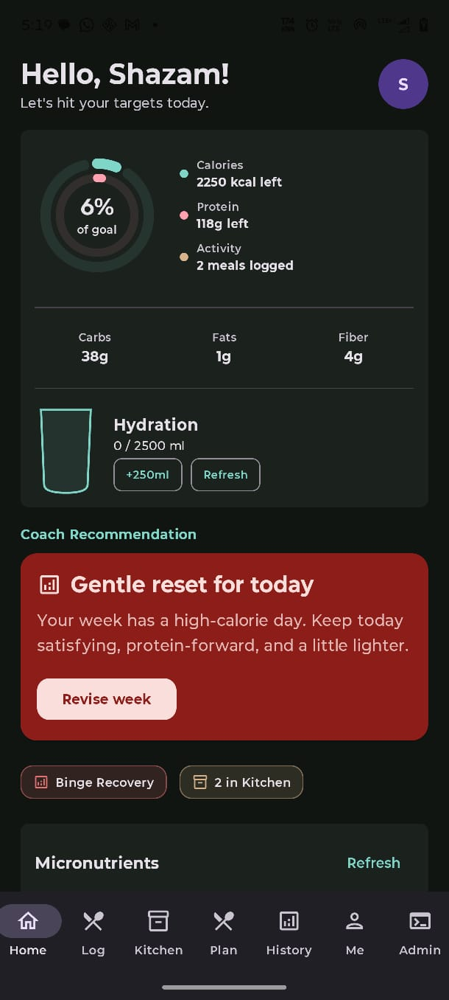 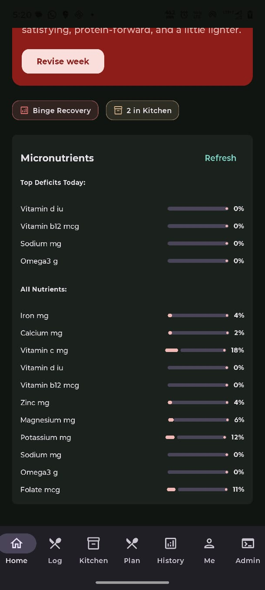 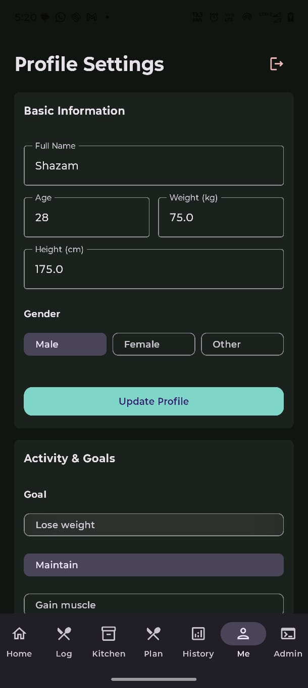 </p> <p align="center"> <b>Home & Profile Screens</b> </p> <br/> <p align="center"> 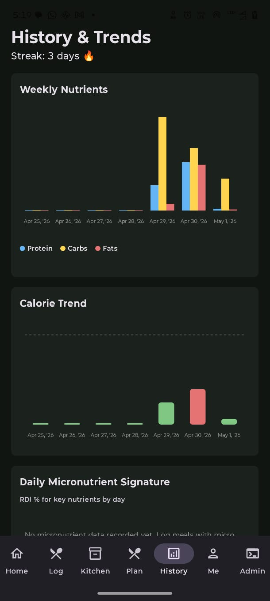 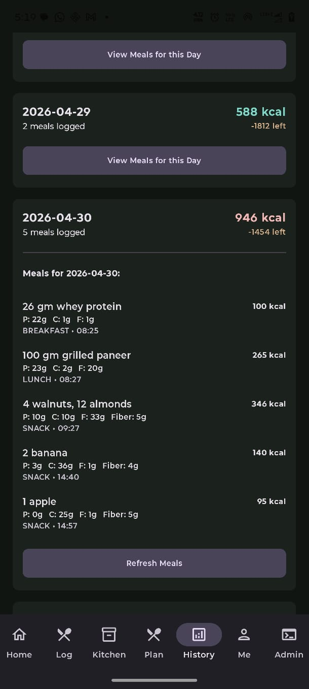 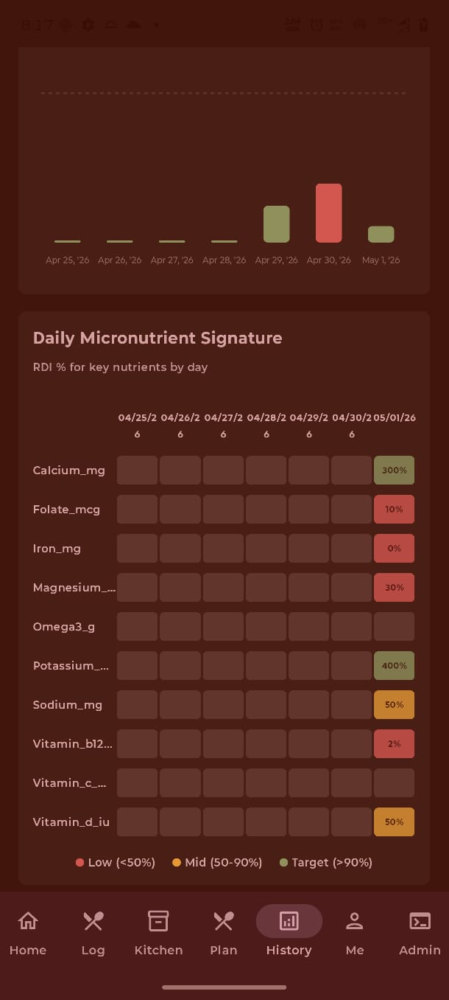  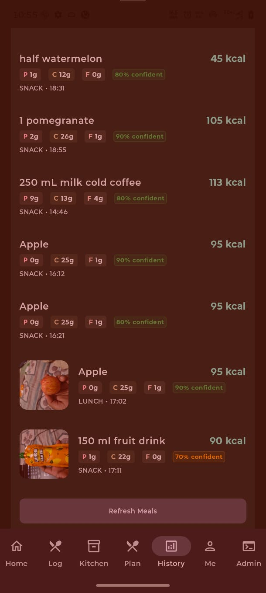 </p> <p align="center"> 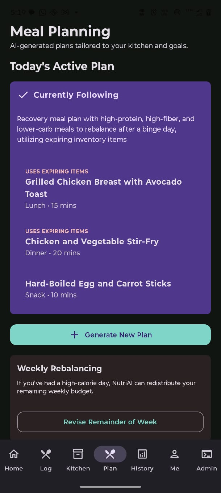 </p> <p align="center"> <b>History & Planning Features</b> </p> <br/> <p align="center"> 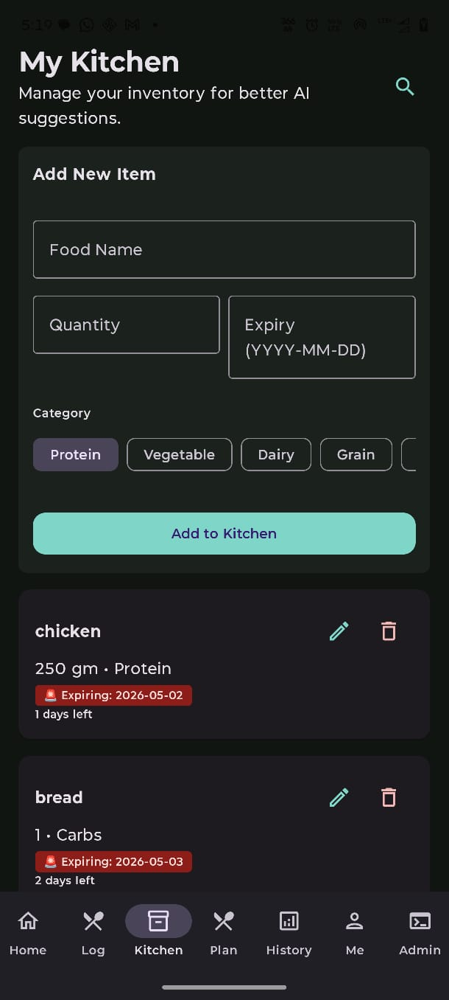 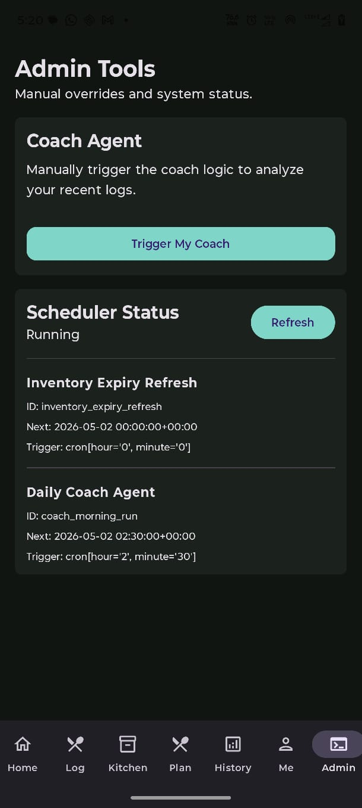 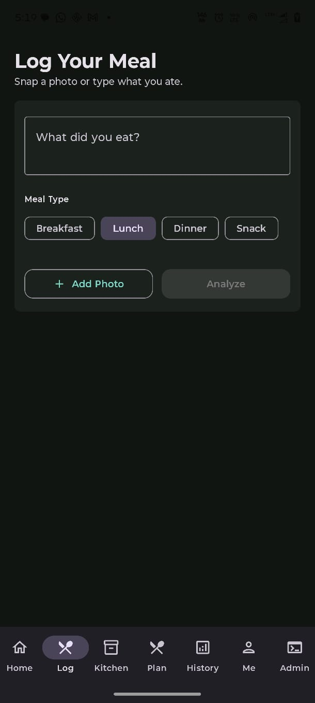 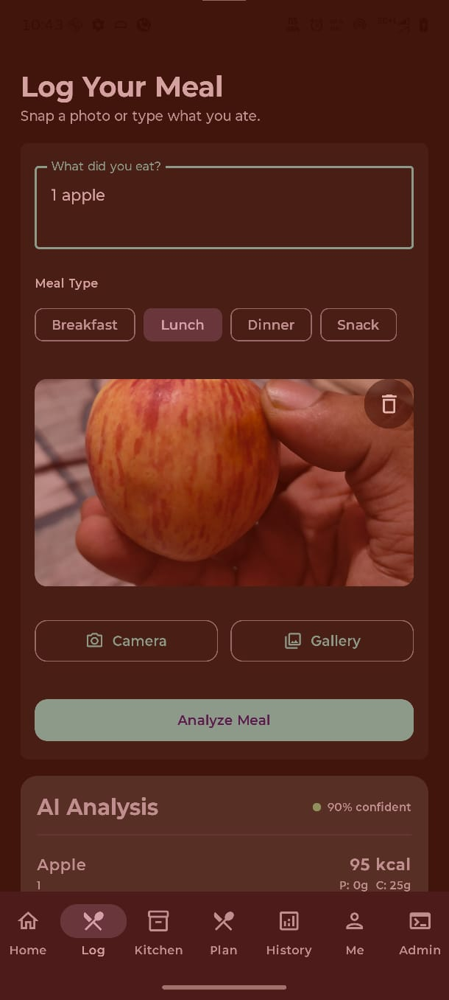 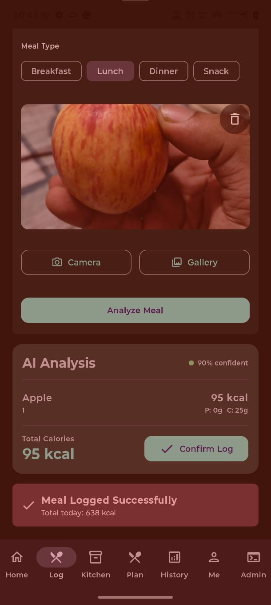 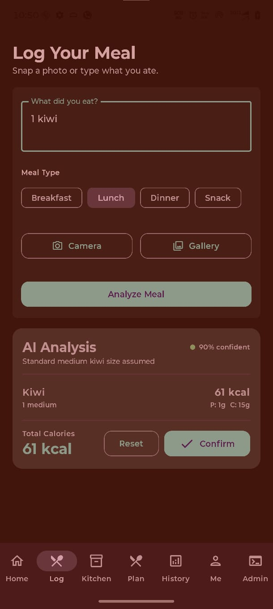 </p> <p align="center"> <b>Kitchen, Admin & Logs</b> </p>
